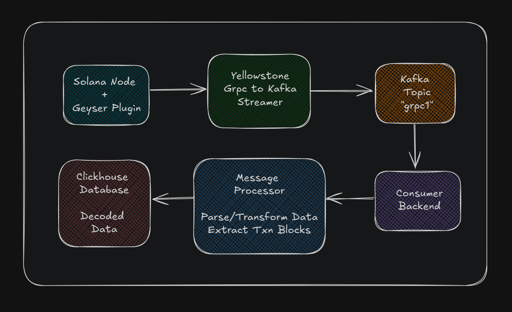

# Solana Blockchain Indexer

A real-time Solana blockchain data indexer that streams transactions and account changes using Yellowstone gRPC Geyser plugin, processes them through Kafka, and stores structured data in ClickHouse for analytics and querying.

## Architecture




## Features

- **Real-time Streaming**: Consumes Solana blockchain data from Kafka topics
- **Protobuf Decoding**: Decodes Yellowstone gRPC protobuf messages (ConfirmedBlock, ConfirmedTransaction, Transaction)
- **Table Storage**: Stores all data in ClickHouse
- **RESTful API**: Provides endpoints for querying and managing data
- **TypeScript**: Fully typed codebase for better development experience
- **Graceful Shutdown**: Proper cleanup of Kafka and ClickHouse connections

## Tech Stack

- **Backend**: Node.js + Express + TypeScript
- **Message Queue**: Apache Kafka
- **Database**: ClickHouse
- **Protobuf**: protobufjs for message decoding
- **Blockchain**: Solana (via Yellowstone gRPC Geyser plugin)

## Prerequisites

- Node.js 18+ and npm
- Apache Kafka running on `localhost:9092`
- ClickHouse running on `localhost:8123`
- Solana node with Yellowstone gRPC Geyser plugin streaming to Kafka topic `grpc1`

## Installation

1. **Clone and setup the project:**

```bash
git clone <repository-url>
cd project/indexer/backend
npm install
```

2. **Build TypeScript:**

```bash
npm run build
```

3. **Start the server:**

```bash
# Development mode with auto-reload
npm run dev

# Production mode
npm start
```

The server will start on `http://localhost:3000`

## Project Structure

```
backend/
├── src/
│   ├── database/
│   │   └── clickhouse.ts          # ClickHouse client and table management
│   ├── kafka/
│   │   └── consumer.ts            # Kafka consumer setup
│   ├── protobuf/
│   │   └── decoder.ts             # Protobuf message decoding
│   ├── routes/
│   │   └── index.ts               # API routes
│   ├── services/
│   │   └── message-processor.ts   # Core message processing logic
│   ├── types/
│   │   └── index.ts               # TypeScript interfaces
│   ├── utils/
│   │   └── timestamp.ts           # Timestamp formatting utilities
│   └── server.ts                  # Main server entry point
├── message.proto                  # Solana protobuf schema
├── package.json
├── tsconfig.json
└── README.md
```

## API Endpoints

### General Information

- `GET /` - Server status and configuration

### Block Data Management

- `GET /stats` - Database statistics (total blocks, protobuf decoded, decode success)
- `GET /blocks?limit=10` - Get recent blocks from ClickHouse
- `DELETE /blocks` - Clear all blocks from database

## Database Schema

### ClickHouse Table

#### `blocks`

Stores all processed Kafka messages with decoded data:

```sql
CREATE TABLE blocks (
  timestamp DateTime64(3),
  topic String,
  partition UInt32,
  offset String,
  message_type String,
  decoded_data String,
  is_protobuf Bool,
  decode_success Bool
) ENGINE = MergeTree()
ORDER BY (timestamp, topic, partition, offset)
```

**Fields:**

- `timestamp` - When the message was processed
- `topic` - Kafka topic name (grpc1)
- `partition` - Kafka partition number
- `offset` - Kafka message offset
- `message_type` - Type of decoded message (ConfirmedBlock, JSON, Raw, etc.)
- `decoded_data` - JSON string of the decoded message content
- `is_protobuf` - Whether message was successfully decoded as protobuf
- `decode_success` - Whether any decoding was successful

## Usage Examples

### Get Database Statistics

```bash
curl http://localhost:3000/stats
```

Response:

```json
{
  "stats": {
    "total_blocks": 1250,
    "protobuf_decoded": 1200,
    "decode_success": 1240
  }
}
```

### Query Recent Blocks

```bash
curl http://localhost:3000/blocks?limit=5
```

### Clear All Data

```bash
curl -X DELETE http://localhost:3000/blocks
```

### ClickHouse Direct Queries

```sql
-- Get message type distribution
SELECT
  message_type,
  COUNT(*) as count
FROM blocks
GROUP BY message_type
ORDER BY count DESC;

-- Get recent protobuf messages
SELECT
  timestamp,
  message_type,
  is_protobuf,
  decode_success
FROM blocks
WHERE is_protobuf = true
ORDER BY timestamp DESC
LIMIT 10;

-- Get processing success rate
SELECT
  toDate(timestamp) as date,
  COUNT(*) as total_messages,
  SUM(decode_success) as successful_decodes,
  (SUM(decode_success) * 100.0 / COUNT(*)) as success_rate
FROM blocks
GROUP BY toDate(timestamp)
ORDER BY date DESC;
```

## Development

### Available Scripts

- `npm run build` - Compile TypeScript to JavaScript
- `npm run dev` - Start development server with auto-reload
- `npm run dev:watch` - Start with file watching
- `npm start` - Start production server

### Environment Variables

- `PORT` - Server port (default: 3000)

## Monitoring and Debugging

The application provides comprehensive logging:

- Raw message hex bytes for protobuf debugging
- Message type identification
- Decode success/failure status
- ClickHouse operation status

All data is stored in ClickHouse for analysis and debugging.

## Data Flow

1. **Kafka Consumer** receives messages from `grpc1` topic
2. **Message Processor** attempts to decode messages in this order:
   - Protobuf (ConfirmedBlock → ConfirmedTransaction → Transaction)
   - JSON parsing
   - Raw data storage
3. **ClickHouse Writer** stores all messages with metadata in `blocks` table
4. **API Endpoints** provide access to stored data and statistics

## Contributing

1. Fork the repository
2. Create a feature branch
3. Make your changes
4. Add tests if applicable
5. Submit a pull request
